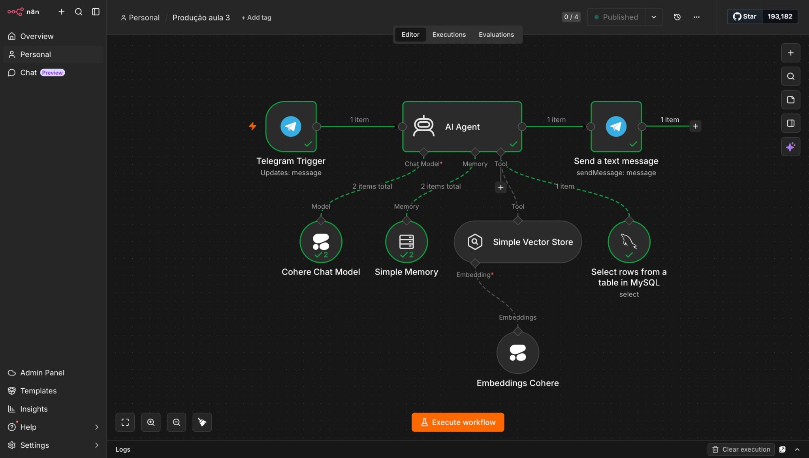
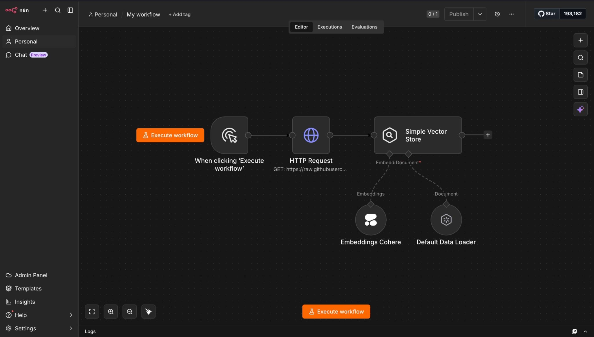
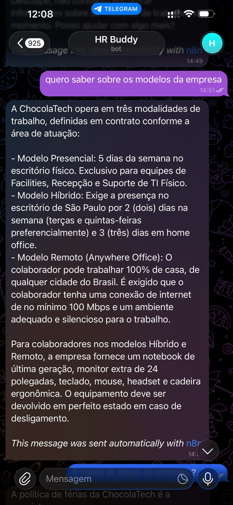
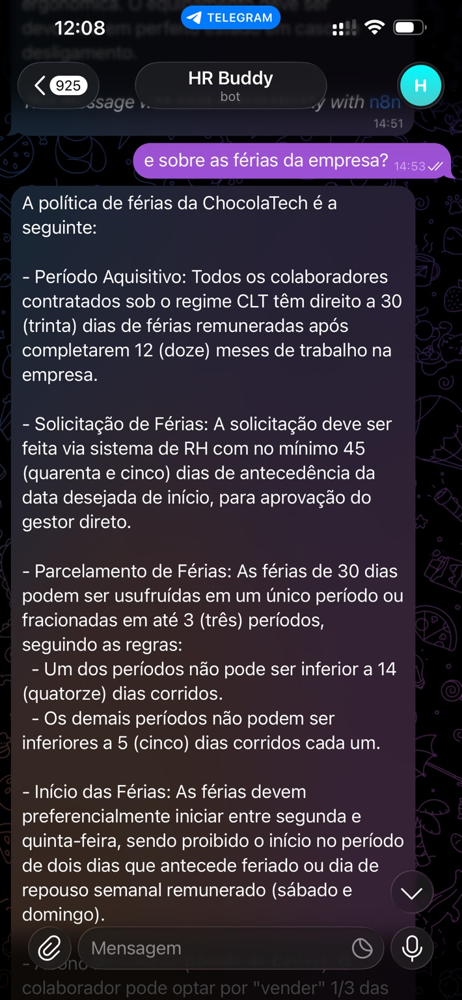
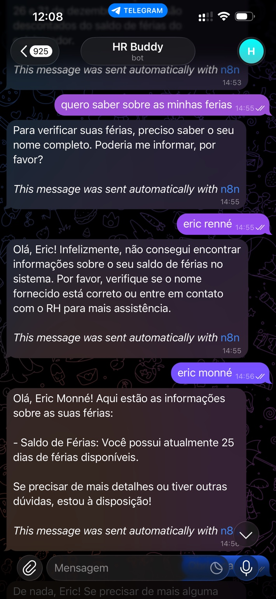

🇧🇷 Português | [🇺🇸 English](README.en.md)

# 🤖 Assistente de RH com RAG

Assistente virtual de Recursos Humanos desenvolvido durante a **Imersão de Agentes de IA da Oracle + Alura**, utilizando uma abordagem low-code para integrar Inteligência Artificial Generativa, RAG, banco de dados e automação de workflows.

O projeto simula um assistente interno de RH capaz de responder dúvidas sobre uma empresa fictícia e consultar informações específicas de colaboradores por meio do Telegram.

> Este repositório funciona como um case study do projeto. O ambiente original utilizado durante a imersão não está mais disponível e, por isso, os arquivos originais dos workflows não puderam ser preservados.

---

## 📌 Sobre o projeto

O objetivo do projeto foi construir um agente de IA capaz de lidar com diferentes tipos de solicitações relacionadas a Recursos Humanos.

Por meio de uma conversa no Telegram, o usuário podia fazer perguntas sobre informações gerais da empresa, como:

- modelos de trabalho;
- política de férias;
- regras e informações corporativas.

Além disso, o agente também podia consultar dados estruturados de colaboradores armazenados em um banco MySQL.

Dessa forma, a solução combinava informações recuperadas por meio de **RAG (Retrieval-Augmented Generation)** com consultas a dados estruturados.

---

## ⚙️ Como a solução funciona

O fluxo principal foi construído no **n8n**, responsável pela orquestração dos diferentes componentes da solução.

Uma mensagem enviada pelo Telegram acionava o agente, que interpretava a solicitação e utilizava diferentes fontes de informação de acordo com o contexto da pergunta.

### Fluxo simplificado

```text
Usuário
   ↓
Telegram
   ↓
n8n
   ↓
AI Agent
   ├── Cohere Chat Model
   ├── Memory
   ├── Vector Store / RAG
   └── MySQL
   ↓
Telegram
   ↓
Resposta ao usuário
```

O agente podia recuperar informações a partir do contexto vetorial ou consultar dados estruturados no banco, dependendo do tipo de solicitação realizada.

---

## 🤖 Workflow principal do agente

O workflow principal conecta o Telegram ao agente de IA e às diferentes ferramentas utilizadas durante a execução.

Entre os componentes presentes no fluxo estão:

- modelo de linguagem da Cohere;
- memória da conversa;
- armazenamento vetorial;
- embeddings;
- consultas ao MySQL;
- integração com Telegram.



---

## 🧠 RAG e recuperação de contexto

Parte das informações utilizadas pelo agente era preparada em um workflow separado.

Nesse processo, uma fonte externa era acessada por meio de uma requisição HTTP e seus dados eram carregados para processamento.

A Cohere era utilizada para gerar **embeddings**, representações vetoriais dos conteúdos que permitiam posteriormente realizar buscas por similaridade.

Esses dados eram armazenados em um **Vector Store**, permitindo que o agente recuperasse informações relevantes durante as conversas.

### Fluxo simplificado de preparação dos dados

```text
Fonte de dados
     ↓
HTTP Request
     ↓
Data Loader
     ↓
Cohere Embeddings
     ↓
Vector Store
     ↓
Recuperação de contexto pelo agente
```

### Workflow de preparação dos dados



---

## 💬 Exemplos de interação

### Informações gerais da empresa

O agente conseguia responder perguntas sobre informações institucionais armazenadas em sua base de conhecimento.

No exemplo abaixo, o usuário pergunta sobre os modelos de trabalho oferecidos pela empresa fictícia utilizada durante o projeto.
<p align="center">
  
</p>

---

### Política de férias

O mecanismo de recuperação de contexto também permitia responder perguntas sobre políticas internas.

No exemplo abaixo, o agente recupera informações relacionadas às regras de férias da empresa e apresenta a resposta diretamente pelo Telegram.

<p align="center">
  
</p>

---

### Consulta a dados específicos de colaboradores

Além da recuperação de informações gerais, o agente também conseguia consultar dados estruturados armazenados em um banco **MySQL**.

Para solicitações relacionadas a informações individuais, como saldo de férias, o agente utilizava o nome informado para buscar um registro correspondente na base.

Durante os testes, foi informado inicialmente o nome **"Eric Renné"**.

Como esse nome não possuía correspondência no banco de dados utilizado pelo projeto, o agente informou que não havia encontrado informações para aquele colaborador.

Em seguida, foi informado **"Eric Monné"**, nome presente na base utilizada no cenário. O agente conseguiu então recuperar corretamente o saldo de férias correspondente.

<p align="center">
  
</p>

Esse comportamento demonstra a integração entre o agente de IA e uma fonte de dados estruturada, fazendo com que a resposta dependesse dos registros efetivamente disponíveis no banco.

> Os nomes, empresas e dados apresentados nas demonstrações pertencem ao cenário fictício utilizado durante o projeto e não representam informações reais de colaboradores.

---

## 🛠️ Tecnologias utilizadas

### Tecnologias

- **n8n** — construção e orquestração dos workflows;
- **Cohere Chat Model** — modelo de linguagem utilizado pelo agente;
- **Cohere Embeddings** — geração das representações vetoriais;
- **MySQL** — armazenamento e consulta de dados estruturados;
- **Telegram Bot** — interface utilizada para interação com o agente;
- **Simple Vector Store** — armazenamento dos dados vetoriais.

---

## 📚 Conceitos e aprendizados

O projeto representou meu primeiro contato prático com vários conceitos relacionados a Inteligência Artificial Generativa, agentes de IA e automação.

Durante a imersão, pude explorar na prática:

- funcionamento de agentes de IA;
- RAG (Retrieval-Augmented Generation);
- embeddings e armazenamento vetorial;
- recuperação de contexto;
- memória em agentes;
- integração entre LLMs e fontes externas;
- integração com bancos de dados relacionais;
- automação de workflows com n8n;
- integração entre diferentes serviços;
- utilização do Telegram como interface para o agente;
- desenvolvimento low-code;
- testes e troubleshooting de workflows.

Mais do que conhecer cada tecnologia individualmente, o projeto me ajudou a compreender como esses componentes podem ser conectados em uma única solução capaz de interpretar solicitações, recuperar informações de diferentes fontes, consultar dados estruturados e gerar respostas contextualizadas.

---

## ⚠️ Sobre este repositório

Algumas das plataformas utilizadas possuíam acesso gratuito limitado. Após o encerramento desse acesso, o ambiente utilizado no projeto deixou de estar disponível e os workflows originais não puderam mais ser recuperados.

Por isso, este repositório tem como objetivo documentar a solução por meio de sua arquitetura, tecnologias, capturas de tela e aprendizados obtidos durante o desenvolvimento.

Ele, portanto, **não representa uma implementação atualmente executável**, mas registra o desenvolvimento e o funcionamento da solução construída durante a experiência.
